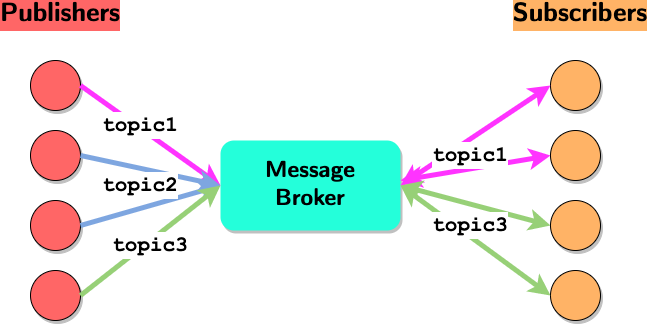

# Message-Broker

A simple and lightweight message broker built using only Go std libraries from go and packaged as Unikernel as well as Container.



# ✨ Get Started

## 🗄️ Instantiate a Broker server

Here a guide on how to build a server from source, using docker or using unikernels.

### Build your Container image

Build the broker container image using docker CLI and tag the image with a tag of your choice. In this example we'll use `MessageBrokerServer`
```shell
$ docker build . -t message_broker_server
```

When running the container, by default, the server will listen on port `9999`

### Build your Unikraft unikernel

Make sure you have [kraft](https://github.com/unikraft/kraft) intstalled first.

Then, configure the application
```shell
kraft configure
```

Build the application
```shell
kraft build
```

Run the application
```shell
kraft run -M 512
```

### From source

Install Go >= 1.20 and run the following command from the base directory of this repo
```shell
 go run examples/server/server.go
```

## 💻 Create your client with Go

First import  the message borker client library
```go
import(
    mbclient "github.com/giobart/Message-Broker/pkg/client"
)
```
Then instantiate a new client

```go
client := mbclient.GetMessageBrokerClient("0.0.0.0:9999", mbclient.WithCustomListenPort(10000))
```

### Subscribe to a topic

```go
//Subscribe to topic hello/world with a callback
err := client.Subscribe("hello/world", func(data string, topic string) {
	log.Default().Printf("RECEIVED: %s", data)
})
if err != nil {
    //Error handling code
}
```

The callback function is called every time new data is available for the topic.

### Publish data to a topic

```go
//Send "MyData" to hello/world topic
err = client.Publish("MyData", "hello/world")
if err != nil {
	log.Default().Print(err)
}
```

The published data will be dispatched by the broker to all the subscribers. 

# ⚠️ Warnings

Missing features from the broker:
- No data persistence 
- No QoS guarantee or retransmission. 